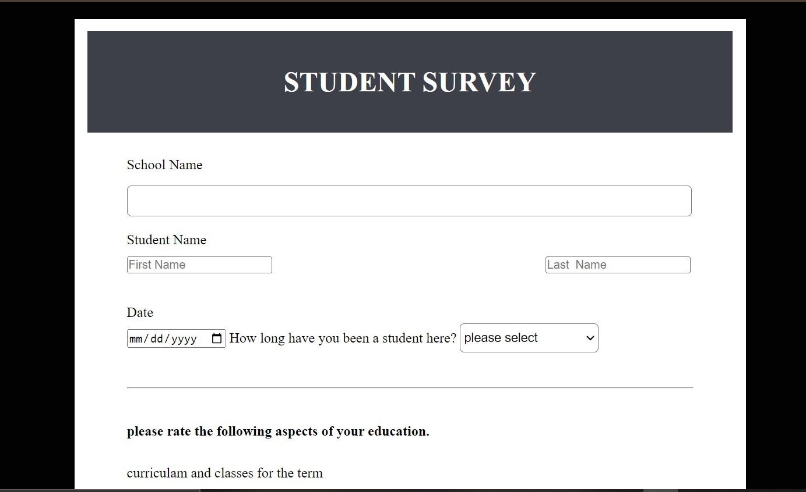

# Survey-Form🚀

## Project Description 📝
survey form is a structured questionnaire designed to gather information🔹 from respondents about their opinions, preferences, behaviors, or🔹 demographic characteristics. It typically consists of a series of🔹 questions, which can be open-ended or closed-ended, and may include🔹 multiple-choice, rating scales, or free-text responses.🔹
> 

Demo 📸

✅1:-- Introduction to HTML: 
✅2:-- HTML Elements and Tags: 
✅3:-- Attributes and Values: 

## Technologies Used 🛠️

- 🔹HTML
- 🔹CSS 

## general requirement💻❗
Certainly! Here's a step-by-step guide to installing and setting up a technical documentation page project:

Prerequisites:

1️⃣creat a new repository in your github
2️⃣Create a New Project Directory:

  >Open your terminal or command prompt.
  >Navigate to the directory where you want to create your project.
  >Run the following command to create a new directory for your project:
  >bash
  >Copy code
  >mkdir documentation-project

3️⃣open HTML in any program such you want ssuch us: vscode, terminal and cmd.

4️⃣creat a uniqe HTML file.
5️⃣give a style to project by creating style.css file.
6️⃣ use (git add, git commint, git push) in the git bash to push it in  Github.
7️⃣Make a string and uniqe project-Readme.md file.

## Features ⭐
1.Declares the document to be an Survey form document, ensuring modern standards are used.

By following this structure, you can create informative and visually appealing web pages that adhere to modern web standards.

## Author 🔵✅

- Github: [WALWALA SAFI](https://github.com/WALWALASAFI/technical_documentation_page.git)
- LinkedIn: [walwala safi](https://linkedin.com/in/walwalasafi)
- Email: [walwala safi ](walwalasafi99@gmail.com)

## Contributing 🤝

Thank you for considering contributing to [Survey-form]! We welcome contributions from individuals like you who are passionate about improving our project. Below are some guidelines to help you get started.
Code of Conduct:

1: Before contributing, please familiarize yourself with our Code of Conduct. We expect all contributors to adhere to these guidelines and maintain a respectful and inclusive environment for everyone.

How to Contribute:

There are several ways you can contribute to [Survey-form], including:

Reporting Bugs
Requesting Features
Making Code Contributions via Pull Requests
